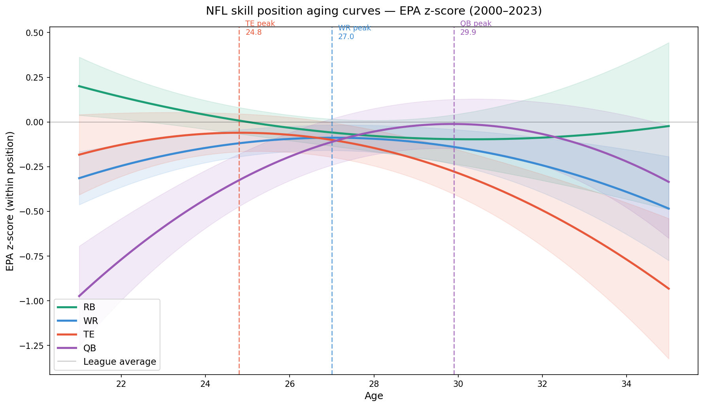

# NFL Skill Position Aging Curves

An end-to-end data science project analyzing and comparing how performance
changes with age across NFL offensive skill positions (RB, WR, TE, QB),
using EPA as a unified cross-position metric and mixed-effects longitudinal
modeling on 24 seasons of data (2000–2023).

## Key Findings

| Position | Peak Age | Pattern |
|----------|----------|---------|
| RB | No clear peak | Slow decline from entry — best relative to peers at age 21 |
| WR | 27.0 | Rise then fall — develops with experience before declining |
| TE | 24.8 | Early peak, sharp post-peak decline |
| QB | 29.9 | Longest development curve — young QBs need time to develop |

**The most striking finding:** QB is the only position where young players
start dramatically below league average for their position — nearly a full
standard deviation below at age 21-22. This may also speak to the short lifespan/leash of a rookie deal QB before teams decide to move on or keep them. Every other position enters the
league close to or above average. This quantifies the experience premium
at quarterback that football analysts have long discussed qualitatively.



---

## Why EPA and Why Standardize?

Raw counting stats (yards, touchdowns) are not comparable across positions —
a QB accumulates far more raw EPA than an RB simply due to touching the ball
on every pass play. Using raw EPA would make QBs dominate every comparison.

**Solution:** Standardize EPA within each position using z-scores — measuring
each player relative to peers at their own position. A z-score of +1.0 means
the player was one standard deviation better than the average player at their
position that season, regardless of position.

---

## Why Mixed-Effects Modeling?

Naive averaging by age produces misleading results due to survivorship bias —
only elite players remain active at age 33-34, artificially inflating average
performance at older ages. Mixed-effects modeling solves this by:

- Fitting each player's individual trajectory via random intercepts
- Estimating the population-level curve from fixed effects
- Correctly expressing uncertainty where sample sizes are thin

---

## Model Specification
```
epa_z ~ age_c + age_c² + (1 | player_id)
```

- **Fixed effects:** centered age + age² — captures quadratic rise-and-fall
- **Random effect:** player intercept — accounts for baseline talent differences
- **Estimation:** REML (Restricted Maximum Likelihood)
- **Age centering:** within each position separately
- **Age cap:** 35 — limits survivorship bias tail while keeping legitimate veterans

---

## Data

- **Source:** `nfl_data_py` — NFL seasonal stats and player metadata
- **Seasons:** 2000–2023 (24 seasons)
- **Qualifying thresholds:**
  - RB: 50+ carries
  - WR: 40+ targets
  - TE: 25+ targets
  - QB: 200+ pass attempts
- **Final sample:** 1,501 unique players, 5,480 qualified player-seasons

---

## Project Structure
```
nfl-skill-position-aging-curves/
├── data/
│   └── raw/                        ← raw CSV from ingestion script
├── db/
│   ├── schema.sql                  ← database schema definition
│   ├── load_db.py                  ← loads CSV into SQLite
│   └── nfl_skill_positions.db      ← SQLite database
├── scraper/
│   └── nfl_scraper.py              ← data ingestion script
├── notebooks/
│   ├── 01_eda.ipynb                ← EDA, age distributions, EPA analysis
│   ├── 02_modeling.ipynb           ← mixed-effects models, aging curves
│   └── aging_curve_comparison.png  ← headline chart
├── app/
│   └── streamlit_app.py            ← interactive dashboard
└── requirements.txt
```

---

## How to Run

**1. Clone the repository**
```bash
git clone https://github.com/kennethho193/nfl-skill-position-aging-curves.git
cd nfl-skill-position-aging-curves
```

**2. Create and activate conda environment**
```bash
conda create -n nfl-offense python=3.11
conda activate nfl-offense
```

**3. Install dependencies**
```bash
pip install -r requirements.txt
```

**4. Run the data pipeline**
```bash
python scraper/nfl_scraper.py
python db/load_db.py
```

**5. Launch the dashboard**
```bash
python -m streamlit run app/streamlit_app.py
```

---

## Limitations

- Age calculated as season year minus birth year — does not account
  for exact birth date within the season
- EPA standardization removes absolute differences between positions —
  we can compare aging shapes but not absolute performance levels
- Quadratic model assumes a symmetric curve — real aging may be
  asymmetric with faster post-peak decline than pre-peak rise
- Single position label per player — does not account for players
  who switch positions during their career
- Era effects not controlled for — rule changes over 2000–2023
  affect raw EPA accumulation in ways that may confound aging trends
- TE peak at 24.8 should be interpreted cautiously — the curve is
  statistically significant but visually flat suggesting weak effect

## Future Directions

- **Era-adjusted analysis** — normalize EPA by season to account
  for rule changes and offensive evolution since 2000
- **Asymmetric modeling** — fit separate slopes for pre and post
  peak to test whether decline is faster than development
- **Positional transition modeling** — track players who switch
  positions and model their aging at each role separately
- **Draft round stratification** — test whether first round picks
  age differently than later round players at each position
- **Survival analysis** — model career length per position using
  Cox proportional hazards.
- **Offensive line extension** — explore pass block win rate and
  other advanced OL metrics if sufficient historical data exists
- **Special teams analysis** — test whether kickers and punters
  show meaningful age-related decline given their long careers

---

## Tools & Libraries

Python, SQL, pandas, numpy, statsmodels, matplotlib, seaborn,
streamlit, nfl_data_py, SQLite, Git

---

## Author

Kenneth Ho  